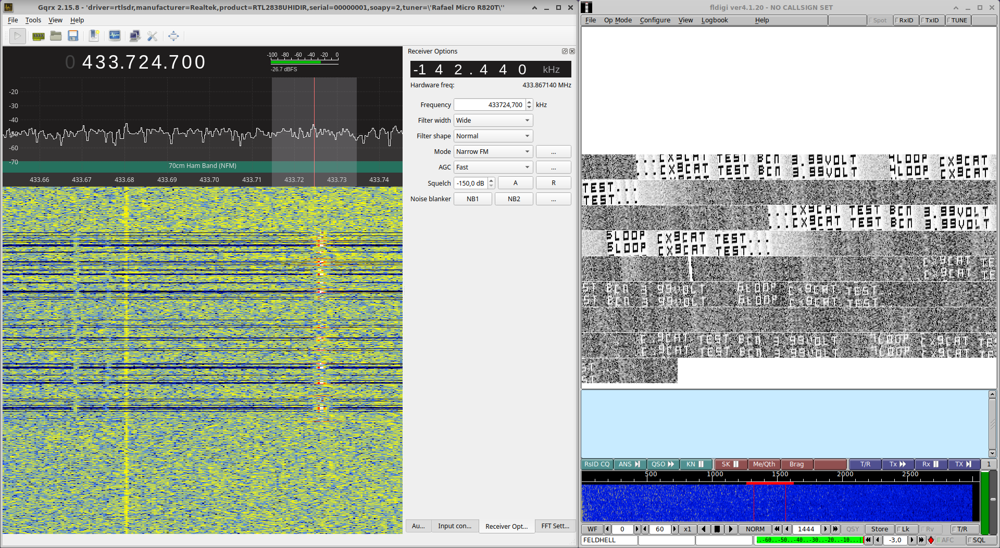

# Solar Hellschreiber Beacon with 433 MHz UHF Module

This beacon project uses a solar panel, a micro-controller (MCU) and a radio module to transmit an ID or call sign and very basic telemetry. The radio digital-mode/protocol used is Hellschreiber implemented with ‣ library. Components are cheap and easy to find.


Signals sent by the beacon can be decoded with `fldigi` or other Hellschreiber decoder:


It’s design is very simple, just three main components:

- Solar panel (3.5 - 5 volts)
- 433 MHz FS1000A Radio Module (~$2 USD)
- ATtiny85 (~$2.5 USD)


# ⚡ Solar power

A single solar panel is used for powering both the MCU and the radio module. Brand and specs are unknown, it was from an old solar/battery charger. The solar charger case was also recycled ♻️ to house the beacon.


The panel, at full sun, outputs about 4.7 Volts. Any interference with the light source will make the output voltage fluctuate and create some side effects:

- Transmission frequency variations: this cheap transmitter module needs very constant input source, power regulation should help here.
- MCU hanging due to low voltage: common when almost no light is reaching the panel, when good input power is restored the MCU tends to continue with normal operations.

This two side effects for now are not critical, the beacon will do it’s best effort to transmit with as litter power as it can. When MCU is hanged, the radio module transmits a constant carrier that can be used to track the beacon.

# 📶 Radio transmitter

The cheapest RF module that I could find, about 2 USD for both transmitter and receiver. We will only use the transmitter. Model of the module is *FS1000A* but is usually found by searching “433 Arduino module”:


Connections:

- `GND`: To the negative/GND connector of the solar panel
- `VCC`: To the positive/VCC connector of the solar panel, no power regulation/limit is needed since the module can support up to 10V
- `DATA`: To the digital pin of the MCU that will be used for transmission (in this example, the A0 PIN of the ATTiny85 MCU)

Any radio frequency generator or module can be used, since Hellschreiber is OOK (ON/OFF Keying) we just need to generate a signal and “not” generate signal with accurate timing in a similar way that CW (Morse) is modulated.

Since the transmitter does not have too much power a good **antenna is important**: use at least a 17cm wire (about 1/4 wave) as antenna. This antenna can be improved by adding another 17cm wire to the GND connection. Search about how to build a dipole for additional instructions: [https://www.google.com/search?q=dipole antenna for 433 mhz](https://www.google.com/search?q=dipole%20antenna%20for%20433%20mhz).

# 🤖 Hellschreiber beacon

Micro-controllers *compatible with Arduino* should work with this example code. https://github.com/lu1aat/hellschreiberlib library is used to modulate signals thought the RF module, must be installed in the Arduino IDE in order to compile and upload the sketch:

```cpp
/*
   Hellschreiber basic beacon

   Beacon example:

   "... CX9CAT TEST BCN 3.47VOLT 32LOOP CX9CAT ..."

   Structure:
              - Hell Header
              - Hell Telemetry
              - Hell Trail

*/
#include <Arduino.h>

#include <Hell.h>

int SLEEP_SECONDS = 30;
int PIN_TX = PB0;
char message[8];
unsigned int loop_counter = 0;

Hell hell(PIN_TX);

// Get voltage from MCU
// this function was taken from: http://provideyourown.com/2012/secret-arduino-voltmeter-measure-battery-voltage/
double getVoltage() {
  ADMUX = _BV(MUX3) | _BV(MUX2);
  delay(2);
  ADCSRA |= _BV(ADSC);
  while (bit_is_set(ADCSRA, ADSC));
  uint8_t low  = ADCL;
  uint8_t high = ADCH;
  double result = (high << 8) | low;
  result = 1125300L / result;
  ADMUX &= ~(REFS0);
  ADMUX &= ~(REFS1);
  return result; // Vcc in millivolts
}

// Setup
void setup() {
  // Send ... when the MCU is powered
  hell.tx("...");
}

// Loop
void loop() {
  //
  // Header
  //
  hell.tx("...CX9CAT TEST BCN");
  delay(500);

  //
  // TLM
  //
  int tmpReading;

  // Voltage
  dtostrf(getVoltage() / 1000, 2, 2, message);
  hell.tx(message);
  hell.tx("VOLT");
  delay(500);

  // Loop counter
  dtostrf(loop_counter, 4, 0, message);
  hell.tx(message);
  hell.tx("LOOP");
  loop_counter = loop_counter + 1;

  //
  // Trail
  //
  delay(500);
  hell.tx("CX9CAT TEST...");

  //
  // Sleep
  //
  delay(SLEEP_SECONDS * 1000UL);
}
```

The `PB0` value for the `PIN_TX` variable sets the pin that will be connected to the `DATA` pin in the radio module.

The beacon is composed of a header, telemetry and trail. When transmission ends, there is an sleep period where the beacon does not transmit. This interval can be set in the `SLEEP_SECONDS` variable:

- Header: `... CX9CAT TEST BCN`
- Telemetry:
  - `3.47VOLT`: MCU voltage measure in volts
  - `15LOOP`: The number of "loops" or times the beacon was transmited since last MCU power up, this number resets each time the beacon does not have power to run
- Trail: `CX9CAT TEST...`

Tuning the radio or SDR around 433.800 MHz, searching for the pulsating Hellschreiber carrier:


Decode with the incredible `fldigi` [https://sourceforge.net/projects/fldigi/](https://sourceforge.net/projects/fldigi/):



In the image above, the beacon was decoded first using USB (upper side band) and then FM (frequency modulation); information can be inferred using both modes 🙂. 

## ✏️ Other ideas

- [Use a Pixie kit as radio transmitter for HF 80 meter ~7023 MHz](https://github.com/lu1aat/hellschreiberlib/tree/main/extras/pixie).
- Add more solar panels for more RF power, remember that the MCU does not handle too much voltage so it must be regulated to 5V.
- More telemetry: temperature sensors, light sensors, analog inputs, etc.
- Use other modules like SYN115, STX882, EDRF1 or pulsate a VCXO.

## 🔗 References

- [https://www.nonstopsystems.com/radio/hellschreiber-software.htm](https://www.nonstopsystems.com/radio/hellschreiber-software.htm)
- [http://www.w1hkj.com/FldigiHelp/feld_hell_page.html](http://www.w1hkj.com/FldigiHelp/feld_hell_page.html)
- [https://github.com/lu1aat/hellschreiberlib](https://github.com/lu1aat/hellschreiberlib)
- [http://provideyourown.com/2012/secret-arduino-voltmeter-measure-battery-voltage/](http://provideyourown.com/2012/secret-arduino-voltmeter-measure-battery-voltage/)