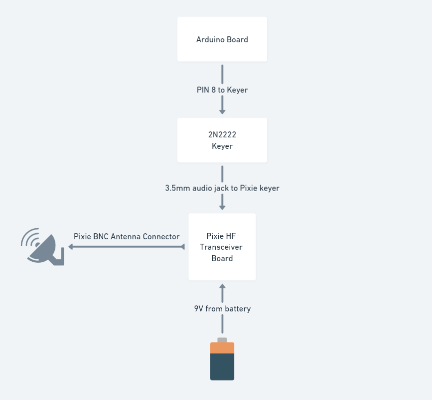
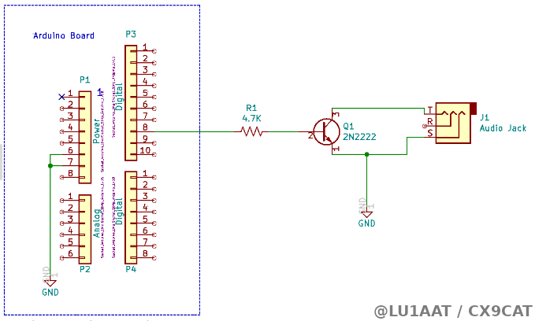
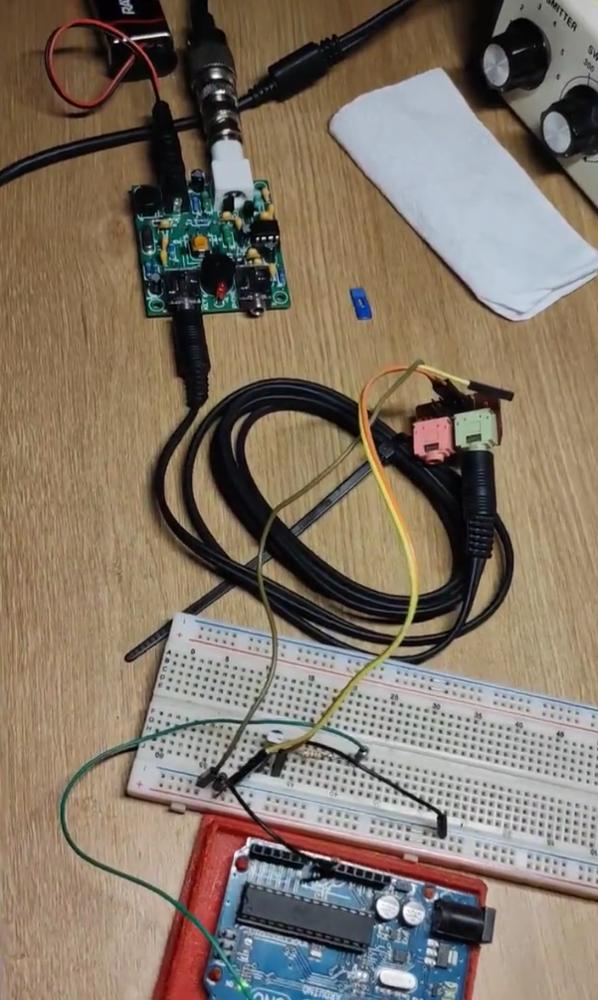

# Arduino + Hellschreiberlib + Pixie HF QRP transciever

```diff
- WARNING: This works but I don't know if it's totally OK. Use at your own risk.
```

An Arduino-like board can be used to drive a "Pixie" CW transceiver into transmitting Feld Hell using Hellschreiberlib.

Here are some demos:

- @LU1AAT: Arduino + Pixie 7023 MHz video https://twitter.com/LU1AAT/status/1553165745009446918
- @LU1AAT: ATTiny85 + Pixie 7023 MHz https://twitter.com/LU1AAT/status/1556406753897709569

The Pixie transceiver is interfaced using the 3.5mm audio jack labeled as `KEY`. The Pixie will transmit when connecting the tip of the connector with GND (ground) and that's what the keyer will do. The keyer is connected to the Arduino board that turns ON/OFF the transmission to modulate Feld Hell signals.




## Arduino 2N2222 switch keyer

The keyer is made with:

- 2N2222 transistor
- 4.7K resistor
- 3.5mm audio



Then the Arduino board PIN is `HIGH`, the transistor let the tip and GND from the audio cable connected to the Pixie to make contact and the transceiver will transmit signal.


## Arduino UNO board

The Arduino board should have Hellschreiberlib setup to PIN 8 for this example to work:

```cpp
#include <Arduino.h>
#include <Hell.h>

Hell hell(8);

void setup() {}

// Loop
void loop() {
  hell.tx("THIS IS A TEST");
}
```




## Using other boards

Tested with ATTiny85, use this guide https://highlowtech.org/?p=1706 to get the Blink example working, then upload your own code that uses Hellschreiberlib.


## Pixie resources

- https://sites.google.com/site/g3xbmqrp3/hf/pixie
- https://www.qsl.net/vu2awc/ham_radio_india_p/Pixie/pixie_transceiver.htm
- https://es.aliexpress.com/item/32525358467.html
- https://www.qsl.net/gaqrp/pixie.htm
- https://www.qsl.net/sp5ddj/pixie3.htm
- https://leap.tardate.com/radio/pixie/
- https://www.aliexpress.com/w/wholesale-qrp-cw-transceiver-pixie.html
- https://www.amazon.com/-/es/S-Pixie-QRP-Transceptor-aficionada-transparente/dp/B08JJ8B7YH